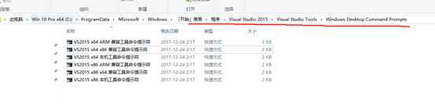
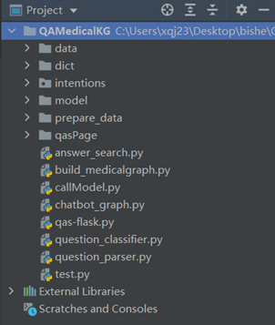
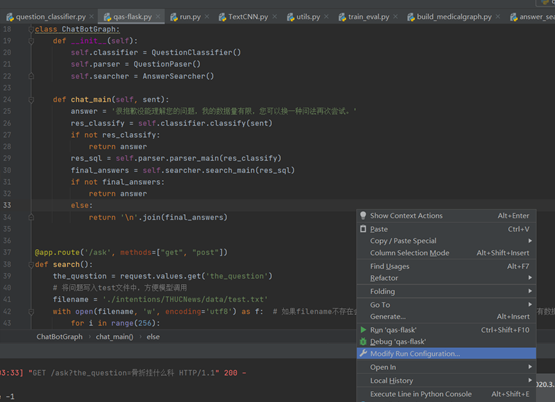
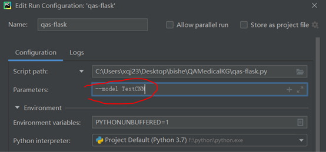

# 项目运行环境

## Neo4j安装

+ [Java SE Development Kit](https://www.oracle.com/java/technologies/javase-downloads.html)
+ [neo4j](https://neo4j.com/download-center/)

设置neo4j数据库用户名密码，并修改build_medicalgraph.py文件第十行的端口、用户名、密码Graph("http://localhost:11014", username=" ", password=””)和answer_search.py第五行同上。

## python环境

安装Python3.79

python安装py2neo包，用于操作neo4j数据库

安装pyahocorasick 包：

pip install pyahocorasick -i https://pypi.tuna.tsinghua.edu.cn/simple/

这个需要VS环境，如果命令行安装提示没有VS环境可以进入

用VS命令行执行pip命令

## Pycharm

版本2020.3.3

# 目录结构介绍

+ data: 存放知识图谱数据集，medical2是部分数据集，medical是完整数据集，完整数据集导入数据库耗时大概几小时，如果只是演示效果可以只是用medical2，但是要注意之后测试时，提问的疾病实体在数据库中存在。

+ dict: 存放各实体导出的txt文件和否定词文件。

+ intentions: textcnn模型训练文件夹。

+ Model: 存放textcnn文件和训练好的模型参数

+ prepare_data: 爬虫数据收集和数据处理部分代码

+ qasPage: 前端界面代码

+ answer_search：数据库查询模块

+ build_medicalgraph：构建知识图谱，写数据库

+ callModel：调用意图分类模型

+ chatbot_graph：问答测试入口，仅开发中使用，正式运行使用前端界面提问

+ qas-flask：后台代码

+ question_classifier：问句分类代码

+ question_parser：问句解析，将问句抽象出具体的查询语句

# 运行步骤

1. 开启Neo4j数据库，运行build_medicalgraph文件，构建知识图谱，大概需要等待几小时，只有第一次初始化需要运行build_medicalgraph，之后只需要开启数据库即可。

2. 运行qas-flask文件，开启后台。运行时配置--model TextCNN，步骤如下图：

在网络环境正常的情况下运行qasPage中的index.html文件，输入问题即可测试。

正确运行结果为：

